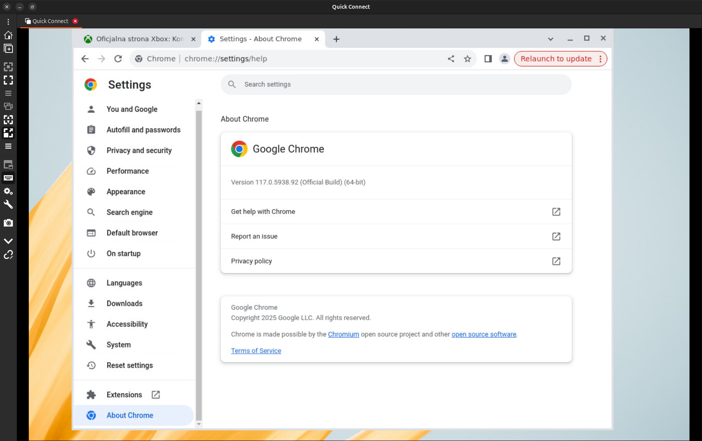

# Docker Containers with Desktop Environment and Chrome

This project consists of two Docker containers:

1. **Base Container**: This container includes the basic packages required to run a desktop environment (DE) using Fluxbox, and optionally a VNC server for remote access.
2. **Chrome Container**: This container is built on top of the base container and installs a specific version of Google Chrome, along with the corresponding version of the chromedriver.

## Base Container

The base container provides a foundation for running a desktop environment within a Docker container. It includes the following features:

- **Fluxbox**: A lightweight and customizable window manager for the desktop environment.
- **VNC Server (optional)**: A VNC server can be started to allow remote access to the desktop environment using a VNC client like Remmina.

This base container can be used as a starting point for creating other Docker images, such as a Firefox container.

## Chrome Container

The Chrome container is built on top of the base container and installs a specific version of Google Chrome. The version of Chrome to be installed is specified using the `CHROME_VERSION` environment variable. For example:

```bash 
CHROME_VERSION=117.0.5938.92
```

When the Chrome container is started, the corresponding version of the chromedriver will be automatically installed in the container:



## How to use it 

You need docker, obviously 😃 and enough RAM on host machine for Chrome shared memory 

First you need to build a base container. Go to `images/base` directory, attach execution rights to the `build.sh` script: 

```bash
sudo chmod +x build.sh
```

then launch the script: 

```bash
./build.sh
```

New docker image will be build with name: `browser-base:latest`. You can use this image for other projects like containered Firefox or AVD (Android Virtual Device) in docker.

Second need to build a new Chrome image. Basically, actions are the same: 

Attach execution rights to the build script for Chrome docker image:

```bash
cd /images/chrome
sudo chmod +x build.sh
```

then launch:

```bash
./build.sh
```

After all actions make sure you have everything for container launch. For launch you need start docker container with this command: 

```bash
docker run --shm-size=2g -e CHROME_VERSION=117.0.5938.92 -p 5900:5900 -p 4444:4444 chrome-custom:latest
```

1. `--shm-size` shared memory limit. Chrome need more than 64MB 
2. `-e CHROME_VERSION=117.0.5938.92` Chrome version/chromedriver version 
3. `-p 5900:5900` port for VNC server (optional)
4. `-p 4444:4444` port for chromedriver
